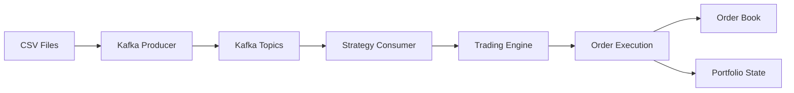

***WORK IN PROGRESS***
# High-Frequency Trading Simulation with Kafka

## Overview
This project simulates a high-frequency trading (HFT) environment using Apache Kafka to stream minute-wise tick data of major tech stocks. The system implements sophisticated HFT-inspired strategies to profit from short-term market inefficiencies and liquidity imbalances.


## Key Features
- **Real-time Data Streaming**: Simulates market data feeds using Kafka
- **HFT Strategies**: Implements liquidity detection and predictive market-making
- **Portfolio Management**: Trades across 6 major tech stocks (AAPL, MSFT, AMZN, NVDA, TSLA, GOOG)
- **Performance Tracking**: Records all trades to an order book with P&L calculation
- **State Persistence**: Maintains positions and cash balance across sessions

## Data Pipeline Architecture

### 1. Data Sources
- Historical minute-wise tick data for 15 years
- Data format: `datetime, open, high, low, close, % change`
- Stocks covered: AAPL, MSFT, AMZN, NVDA, TSLA, GOOG

### 2. Kafka Infrastructure
| Component       | Role                                                                 |
|----------------|----------------------------------------------------------------------|
| **Producer**   | Streams historical data from CSV files to Kafka topics              |
| **Topics**     | Dedicated topic per stock (e.g., `topic_aapl`, `topic_msft`)       |
| **Consumer**   | Processes real-time data and executes trading strategies           |
| **Zookeeper**  | Manages Kafka broker coordination                                   |

### 3. Data Flow


### 4. Message Format
```json
{
  "datetime": "2025-03-07 20:54:00",
  "open": 261.42,
  "high": 262.68,
  "low": 261.42,
  "close": 262.58,
  "% change": 0.4437
}
```

## Trading Strategies

### 1. Liquidity Surge Scalping (LSS) Strategy
**Core Concept**: Identifies institutional order flow through volume spikes and price rejection patterns

#### Entry Signals:
1. **Volume Surge**: 
   - Current volume > 3× 20-minute rolling average
   - Uses absolute % change as volume proxy
   
2. **Price Rejection**:
   - Bullish: `(close - low) / (high - low) > 0.7`
   - Bearish: `(high - close) / (high - low) > 0.7`
   
3. **Trend Confirmation**:
   - 5-min EMA > 20-min EMA for longs
   - 5-min EMA < 20-min EMA for shorts

#### Exit Mechanism:
- **Take Profit**: 0.5× ATR (14-min) from entry
- **Stop Loss**: 0.3× ATR from entry
- **Position Sizing**: 1% of equity per trade

### 2. Hybrid Predictive Market-Making (HPMM)
**Core Concept**: Uses machine learning to predict price direction and adjusts quotes asymmetrically

#### Key Components:
1. **Price Prediction**:
   - XGBoost model forecasts 1-min returns
   - Features: VWAP, volume imbalance, momentum, correlation
   
2. **Quote Management**:
   - Wider bid spread when predicting downside
   - Wider ask spread when predicting upside
   - Inventory-based spread adjustment

3. **Risk Controls**:
   - Position decay mechanism
   - Volatility kill switch (3% threshold)
   - Maximum inventory limits

## System Components

### 1. Producer (`producer.py`)
- Reads historical CSV files
- Streams data to Kafka topics
- Configurable speed (real-time or accelerated)

```python
def stream_data():
    while True:
        for stock in stocks:
            row = get_next_row(stock)
            producer.send(topic, json.dumps(row))
        time.sleep(5)  # 5-second intervals for acceleration
```

### 2. Consumer (`consumer.py`)
- Processes incoming market data
- Manages strategy execution
- Handles position tracking

```python
consumer = Consumer({'bootstrap.servers': 'localhost:9092'})
consumer.subscribe(['topic_aapl', 'topic_msft'])

while True:
    msg = consumer.poll()
    handle_tick(msg.topic(), msg.value())
```

### 3. Trading Engine (`strategy.py`)
- Implements LSS strategy logic
- Maintains rolling windows of price data
- Calculates technical indicators (EMA, ATR)
- Generates buy/sell signals

```python
def handle_tick(stock, data):
    # Update indicators
    update_ema(stock, data['close'])
    update_atr(stock, data)
    
    # Check entry conditions
    if volume_surge(stock) and price_rejection(stock) and trend_confirmation(stock):
        execute_order(stock, 'BUY', calculate_size(stock))
```

### 4. Execution System (`execution.py`)
- Processes orders
- Updates portfolio state
- Records trades to order book

```python
def execute_order(stock, action, qty, price):
    global CASH, POSITIONS
    
    if action == 'BUY':
        CASH -= price * qty
        POSITIONS[stock] += qty
    elif action == 'SELL':
        CASH += price * qty
        POSITIONS[stock] -= qty
        
    record_trade(stock, action, qty, price)
```

### 5. Order Book (`orderbook.py`)
- Maintains complete trade history
- Tracks portfolio equity over time
- CSV output format:
  ```
  timestamp,symbol,action,qty,price,notional,cash,equity
  2025-07-01T22:14:47.265Z,TSLA,BUY,50,262.58,13129.0,86871.0,100000.0
  ```

### 6. Configuration (`config.py`)
- Centralized system parameters
- Portfolio settings
- Strategy parameters

```python
# Kafka Configuration
KAFKA_CONFIG = {'bootstrap.servers': 'localhost:9092'}

# Strategy Parameters
VOLUME_WINDOW = 20
VOLUME_MULTIPLIER = 3.0
RISK_PER_TRADE = 0.01  # 1% of equity
```

## Getting Started

### Prerequisites
- Python 3.9+
- Apache Kafka
- Python packages: `confluent-kafka`, `numpy`

### Installation
1. **Set up Kafka:**
   ```bash
   # Start Zookeeper
   bin/zookeeper-server-start.sh config/zookeeper.properties
   
   # Start Kafka
   bin/kafka-server-start.sh config/server.properties
   
   # Create topics
   bin/kafka-topics.sh --create --topic topic_aapl --bootstrap-server localhost:9092
   bin/kafka-topics.sh --create --topic topic_msft --bootstrap-server localhost:9092
   # Repeat for other stocks
   ```

2. **Install Python dependencies:**
   ```bash
   pip install confluent-kafka numpy
   ```

3. **Prepare data files:**
   - Place CSV files in `data/` directory
   - Naming convention: `AAPL.csv`, `MSFT.csv`, etc.
   - Required columns: `datetime,open,high,low,close,% change`

### Running the Simulation
1. **Start the producer:**
   ```bash
   python producer.py
   ```

2. **Start the consumer:**
   ```bash
   python consumer.py
   ```

3. **Monitor output:**
   - Real-time logs in console
   - Trade records in `order_book.csv`
   - Portfolio state in `trading_state.json`

## Performance Monitoring
Key metrics tracked in order book:
- **Notional Value**: Trade value (price × quantity)
- **Cash Balance**: Available funds
- **Portfolio Equity**: Cash + position values
- **Position Status**: Entry prices and quantities

Use the debug tool to inspect current state:
```bash
python debug.py

# Sample output
=== CURRENT STATE ===
CASH: 87654.32
POSITIONS:
  AAPL: 50 @ 182.76 | Entry: 181.50
  TSLA: -30 @ 265.43 | Entry: 267.20
TOTAL EQUITY: 95678.45
```

## Strategy Calibration
Adjust parameters in `config.py` for different market conditions:
```python
# For volatile markets
VOLUME_MULTIPLIER = 2.5
STOP_LOSS_MULTIPLIER = 0.4

# For range-bound markets
VOLUME_MULTIPLIER = 3.5
TAKE_PROFIT_MULTIPLIER = 0.3
```

## Future Enhancements
1. **Machine Learning Integration**: Add predictive models for price forecasting
2. **Multi-asset Correlation**: Implement pairs trading strategies
3. **Backtesting Framework**: Historical performance analysis
4. **Visual Dashboard**: Real-time P&L monitoring
5. **Risk Management System**: Drawdown controls and volatility scaling

## Conclusion
This HFT simulation provides a realistic environment for testing algorithmic trading strategies using Kafka. By combining market microstructure analysis with real-time data processing, the system captures essential elements of professional trading systems while remaining accessible for research and development.

For questions or contributions, please contact [Your Name] or open an issue in the repository.
