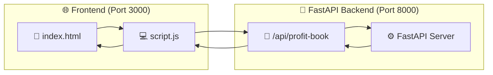
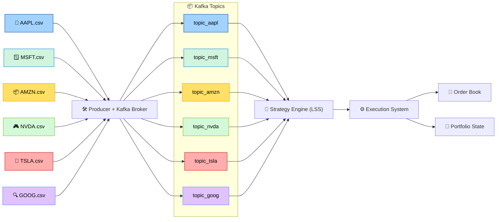

#  TradeBooks: High-Frequency Trading Simulation with Kafka

## 📘 Overview

This simulation replicates a high-frequency trading (HFT) environment using **Apache Kafka** to stream **minute-wise tick data** for major tech stocks. It executes **institutional-style strategies** on historical data using a real-time architecture, producing realistic trade logs and portfolio P\&L updates.
---

## 🔑 Key Features

* 📡 **Real-time Market Simulation** Streamed OHLC data in 1 min intervals using Kafka and Zookeeper in order to simulate market conditions.
* 📈 **Liquidity Surge Scalping Strategy** with EMA & ATR logic
* 💼 **Multi-Stock Portfolio**: AAPL, MSFT, AMZN, NVDA, TSLA, GOOG
* 📊 **Live P\&L & Trade Logs**: Recorded in `order_book.csv`
* 💾 **State Persistence**: Tracks cash, holdings, and equity across ticks
* 🧠 **Modular Components**: Producer, Consumer, Strategy, Execution Engine

---

## 🧱 Kafka Data Pipeline Architecture

### 📊 Source Data

* **Tick granularity**: 1-minute OHLC data for each stock
* **Format**:

```csv
datetime,open,high,low,close,% change
```

### 🔄 End-to-End Flow Diagram

### Frontend

### Data Streaming Pipeline



## 🧠 Trading Strategy: Liquidity Surge Scalping (LSS)

### 📌 Entry Criteria

* 🔺 **Volume Surge**:
  `abs(% change) > 3 × rolling mean (20 min)`

* 🔻 **Price Rejection Patterns**:

  * Bullish: `(close - low) / (high - low) > 0.7`
  * Bearish: `(high - close) / (high - low) > 0.7`

* ✅ **Trend Confirmation**:

  * Long: `EMA_5 > EMA_20`
  * Short: `EMA_5 < EMA_20`

### 🧮 Exit Conditions

* 🎯 Take Profit: `+0.5 × ATR_14`
* 🛑 Stop Loss: `-0.3 × ATR_14`
* 🧷 Position Sizing: `1% of total equity`

---

## 🧩 System Components

### 1. `producer.py`

Streams CSV data to Kafka topics every few seconds:

```python
for stock in stocks:
    row = get_next_row(stock)
    producer.send(topic, json.dumps(row))
```

### 2. `consumer.py`

Consumes messages from Kafka and sends them to the strategy engine:

```python
consumer.subscribe(['topic_aapl', 'topic_msft', ...])
msg = consumer.poll()
handle_tick(msg.topic(), msg.value())
```

### 3. `strategy.py`

Processes tick data and applies trading logic:

```python
if volume_surge(...) and price_rejection(...) and trend_confirmation(...):
    execute_order(stock, 'BUY', calculate_size(...))
```

### 4. `execution.py`

Handles order placement and portfolio updates:

```python
if action == 'BUY':
    CASH -= price * qty
    POSITIONS[stock] += qty
```

### 5. `orderbook.py`

Appends trade records:

```
timestamp,symbol,action,qty,price,notional,cash,equity
```

### 6. `config.py`

Central config for:

* Kafka setup
* Strategy parameters
* Risk rules

---

## ⚙️ Setup & Installation

### ✅ Prerequisites

* Python 3.9+
* Apache Kafka with ZooKeeper
* Python packages:

  ```bash
  pip install -r requirements.txt
  ```

### 📡 Kafka Setup

```bash
# Start Zookeeper
bin/zookeeper-server-start.sh config/zookeeper.properties

# Start Kafka
bin/kafka-server-start.sh config/server.properties

# Create Kafka topics
bin/kafka-topics.sh --create --topic topic_aapl --bootstrap-server localhost:9092
# Repeat for all 6 stocks
```

### 🚀 Running the System

```bash
# Stream historical data
python producer.py

# Start real-time consumer and strategy
python consumer.py
```

---

## 📈 Output & Monitoring

* ✅ Trade logs: `order_book.csv`
* ✅ Portfolio snapshot: `trading_state.json`
* ✅ Live dashboard: Frontend (`index.html`, `script.js`)

---

## 🛠️ Future Enhancements

* 🤖 **ML-based Alpha Generation**
* 📉 **Backtesting Framework**
* 📊 **Real-time Dashboard (Chart.js Integrated)**
* 🧮 **Correlation Strategies (e.g., Pairs Trading)**
* 🔐 **Advanced Risk Controls (e.g., Max Drawdown, Volatility Scaling)**

---

## 📌 Conclusion

This Kafka-driven HFT simulator merges **real-time data pipelines**, **algorithmic strategies**, and **portfolio management** into a cohesive system for experimentation, analysis, and strategy validation.

Let me know if you want:

* A PDF/Markdown version
* Auto-generated Swagger docs for API backend
* Chart.js trade/PnL visualizations integrated with the live order book JSON
* Or enhancements like LSTM forecasts or RL agents for decision making.
