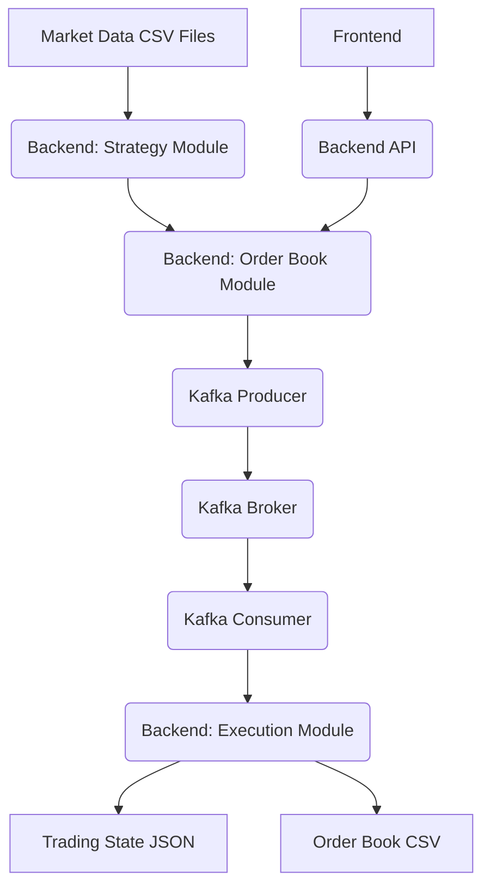

# TradeBooks: Simulating a Trading System

## Overview

TradeBooks is a comprehensive, simulated algorithmic trading platform designed to demonstrate the fundamental components and interactions within a modern trading system. It provides a hands-on environment to explore concepts such as market data processing, order book management, trade execution, and the implementation of rule-based trading strategies. The system leverages Apache Kafka for robust inter-component communication, ensuring a decoupled and scalable architecture, and utilizes simple file-based storage for persistence. While designed for simulation, its modular structure serves as an excellent foundation for understanding the complexities of real-world trading systems.

## Tech Stack:

*   **Backend:** Python 3.x (for core logic, strategy, execution, and Kafka integration)
*   **Frontend:** HTML5, CSS3, JavaScript (for a basic web interface and API testing)
*   **Messaging Queue:** Apache Kafka (for asynchronous, high-throughput communication)
*   **Data Storage:** CSV files (for historical market data and order book snapshots), JSON files (for dynamic trading state)

## 1. System Architecture

The TradeBooks system is meticulously structured into several interconnected, yet independently operable, components. This modularity is key to its design, allowing for clear separation of concerns and potential future scaling.

```mermaid
graph TD
    A[Market Data CSV Files] --> B(Backend: Strategy Module)
    B --> C(Backend: Order Book Module)
    C --> D(Kafka Producer)
    D --> E(Kafka Broker)
    E --> F(Kafka Consumer)
    F --> G(Backend: Execution Module)
    G --> H[Trading State JSON]
    G --> I[Order Book CSV]
    J[Frontend] --> K(Backend API)
    K --> C
```

*   **Backend (Python):** This is the brain of TradeBooks, encompassing the core business logic. It's responsible for:
    *   **Strategy Application:** Analyzing market data and generating trading signals.
    *   **Order Book Management:** Maintaining a real-time view of outstanding buy and sell orders.
    *   **Trade Execution:** Simulating the matching of orders and updating positions.
*   **Kafka (Python):** Serving as the central nervous system, Kafka facilitates asynchronous and reliable communication between different backend modules. It acts as a high-throughput, fault-tolerant message bus, decoupling producers (e.g., strategy generating orders) from consumers (e.g., execution module processing orders). This design choice allows for independent scaling and resilience.
*   **Frontend (HTML/JavaScript):** A lightweight web interface provides a basic means for interaction, visualization, or testing of the backend's API endpoints. It's designed for simplicity, focusing on demonstrating connectivity rather than a full-fledged trading terminal.
*   **Data Storage:** For simplicity and ease of setup in a simulated environment, data is persisted using local files:
    *   **CSV files:** Ideal for static, historical market data (e.g., daily stock prices) and for logging sequential events like order book snapshots.
    *   **JSON files:** Used for dynamic, mutable data such as the current trading portfolio, cash balance, and other system states that require frequent updates.

## 2. Communication Flow

The system's operations are orchestrated through a well-defined communication flow, heavily reliant on Kafka for inter-module messaging:

1.  **Market Data Ingestion:** Historical market data for various assets (e.g., `AAPL.csv`, `GOOG.csv`) is read by the backend. This data serves as the input for the trading strategies.
2.  **Strategy Application:** The `backend/strategy.py` module processes the ingested market data. Based on predefined rules and technical indicators, it generates trading signals or actual orders (e.g., "buy 100 shares of AAPL").
3.  **Order Book Management:** Generated orders are first routed to `backend/orderbook.py`. This module is responsible for maintaining the internal state of the order book, adding new orders, canceling existing ones, and preparing them for execution.
4.  **Kafka Messaging (Producer):** Once an order or a significant trading signal is generated by the strategy or order book, `kafka/producer.py` serializes this information into a message and publishes it to a designated Kafka topic. This ensures that other components can react to these events asynchronously.
5.  **Kafka Broker:** The Kafka broker acts as a central hub, receiving messages from producers and making them available to consumers. It ensures message durability and high availability.
6.  **Kafka Messaging (Consumer):** `kafka/consumer.py` continuously listens for new messages on relevant Kafka topics. When a message arrives (e.g., a new order to be executed), it is consumed and typically passed to the appropriate backend module.
7.  **Trade Execution:** The `backend/execution.py` module receives trade signals/orders via the Kafka consumer. It then simulates the execution of these trades, matching buy and sell orders, updating the simulated portfolio, and calculating profit/loss.
8.  **State Persistence:** After trade execution, the `execution.py` module updates the `trading_state.json` file (for portfolio and cash balance) and potentially logs executed trades or order book changes to `order_book.csv` for historical record-keeping.
9.  **Frontend Interaction:** The `frontend/script.js` can interact with the backend (if an API is exposed, as suggested by `api-test.html`) to display real-time data, visualize order book depth, or potentially send manual trading commands. This interaction would typically involve RESTful API calls.

## 3. File-by-File Breakdown

A detailed look into the project's file structure and the role of each component:

*   **`main.py`**: This file serves as the primary entry point for the TradeBooks backend application. It is responsible for orchestrating the startup of various services, including initializing Kafka producers/consumers, loading initial trading state, and potentially starting an API server to expose backend functionalities.
*   **`api-test.html`**: A simple HTML page designed for manual testing of any RESTful API endpoints exposed by the backend. It provides a quick way to verify connectivity and data exchange without a full-fledged frontend application.
*   **`README.md`**: This comprehensive documentation file, providing an in-depth explanation of the project.
*   **`backend/`**: This directory encapsulates all the core Python logic for the trading system.
    *   **`config.py`**: Stores global configuration settings for the backend. This includes parameters for Kafka broker addresses, file paths for data storage, initial portfolio settings, and crucial strategy parameters (e.g., EMA window sizes, risk percentages). Centralizing configuration here allows for easy modification and tuning of the system's behavior.
    *   **`execution.py`**: Implements the trade execution logic. This module simulates the matching of buy and sell orders, updates the simulated cash balance and stock positions, and records executed trades. It's a simplified execution engine, focusing on the financial impact rather than complex market microstructure.
    *   **`orderbook.py`**: Manages the central limit order book. It handles the submission of new orders, cancellation of existing orders, and the matching process when buy and sell orders cross. This module maintains the current state of all outstanding orders.
    *   **`requirements.txt`**: Lists all Python package dependencies required for the backend to run. This ensures reproducibility of the development environment.
    *   **`strategy.py`**: Contains the algorithmic trading strategies. This is where the "intelligence" of the system resides, analyzing market data and generating trading signals or orders based on predefined rules and technical indicators.
    *   **`backend/data/`**: This subdirectory holds all the data files used by the backend.
        *   `AAPL.csv`, `AMZN.csv`, `GOOG.csv`, `MSFT.csv`, `NVDA.csv`, `TSLA.csv`: These CSV files contain historical stock price data (Open, High, Low, Close, Volume, etc.) for various companies. They serve as the simulated market data feed for backtesting and strategy development.
        *   `order_book.csv`: A CSV file used for persistent storage of order book snapshots or a log of all orders and trades. This allows for analysis of past market activity.
        *   `trading_state.json`: A JSON file that stores the current state of the simulated trading account, including cash balance, current stock holdings, and potentially other portfolio-related metrics. This file is updated dynamically during trade execution.
*   **`frontend/`**: This directory contains the web-based user interface components.
    *   **`index.html`**: The main HTML file that structures the web page, providing the layout for displaying trading information or controls.
    *   **`script.js`**: Contains the JavaScript code for frontend interactivity. This might include fetching data from the backend API, rendering charts, updating displayed metrics, or sending user commands.
*   **`kafka/`**: This directory contains Python scripts for interacting with Apache Kafka.
    *   **`consumer.py`**: A Python script responsible for consuming messages from specified Kafka topics. It acts as a listener, receiving data or commands published by other components.
    *   **`producer.py`**: A Python script responsible for producing messages to specified Kafka topics. It allows backend components to publish events, orders, or data updates to the Kafka message bus.

## 4. Data Structures / Equivalents

The system primarily relies on file-based data storage, serving as a lightweight persistence layer:

*   **CSV Files (e.g., `AAPL.csv`, `order_book.csv`):** These are used for tabular data. `AAPL.csv` and similar files store time-series market data, where each row represents a specific time interval (e.g., a day) and columns represent metrics like open, high, low, close prices, and volume. `order_book.csv` can store a historical log of orders or trade executions. This choice is simple and human-readable, suitable for static or append-only data.
*   **JSON Files (e.g., `trading_state.json`):** JSON is used for storing structured, mutable data that represents the current state of the trading system. `trading_state.json` holds the dynamic portfolio information (e.g., cash, stock quantities, entry prices). JSON's flexibility makes it suitable for frequently updated, hierarchical data.

While not a traditional relational database, these files effectively serve as the persistent storage for the system's operational and historical data within this simulated environment.

## 5. APIs Communication

The backend is implemented using **FastAPI**, a modern, high-performance web framework. It exposes the following RESTful API endpoints:

*   **`/` (GET):** A simple root endpoint returning a welcome message, primarily for health checks.
*   **`/api/profit-book` (GET):** Retrieves the contents of the `order_book.csv` file, providing a historical log of trades or order book snapshots. This endpoint handles `FileNotFoundError` gracefully.

## 6. Detailed Trading Strategy (`backend/strategy.py`)

The `backend/strategy.py` module implements a rule-based trading strategy that combines trend following, volatility adaptation, and momentum indicators. The strategy aims to identify strong directional moves with confirmation from volume and price action, while managing risk dynamically.

### Indicators Used:

1.  **Exponential Moving Averages (EMAs):**
    *   **Purpose:** Used for identifying the prevailing trend. EMAs give more weight to recent prices, making them more responsive to new information than Simple Moving Averages (SMAs).
    *   **Implementation:** Two EMAs are calculated: a `short_window` EMA (e.g., `config.EMA_SHORT_WINDOW`) and a `long_window` EMA (e.g., `config.EMA_LONG_WINDOW`).
    *   **Trend Confirmation:** A bullish trend is indicated when the `ema_short` crosses above and stays above the `ema_long`. Conversely, a bearish trend is indicated when `ema_short` crosses below and stays below `ema_long`.
    *   **Trade-off:** While EMAs are good for trend identification, they are lagging indicators. This means they confirm a trend after it has already started, potentially leading to delayed entries or exits. However, their simplicity and widespread use make them a robust choice for a foundational strategy.

2.  **Average True Range (ATR):**
    *   **Purpose:** Measures market volatility. ATR is crucial for setting dynamic stop-loss and take-profit levels, adapting to current market conditions rather than using fixed price points.
    *   **Implementation:** Calculated over a `config.ATR_WINDOW` period, considering the true range (maximum of current high-low, current high-previous close, current low-previous close).
    *   **Trade-off:** ATR is a historical volatility measure. It doesn't predict future volatility but provides a good estimate of recent price swings. Using it for risk management is superior to fixed percentages as it accounts for the instrument's natural movement.

3.  **Volume Proxy (`% change`):**
    *   **Purpose:** Used to detect "volume surges," indicating strong momentum or increased interest in an asset.
    *   **Implementation:** In the absence of direct volume data in the provided CSVs, the absolute percentage change (`abs(data.get('% change', 0))`) of the current bar is used as a proxy for volume. A "surge" is detected if this proxy exceeds a `config.VOLUME_MULTIPLIER` times the average of recent volume proxies.
    *   **Trade-off:** This is a significant simplification. Actual trading volume provides much more reliable information about market participation and conviction. Using `% change` as a proxy is a pragmatic choice for this simulated environment given the available data, but it's less accurate and could lead to false signals compared to real volume data.

4.  **Price Rejection Signal:**
    *   **Purpose:** Identifies potential reversals or strong directional conviction based on the shape of the previous price bar (candlestick).
    *   **Implementation:** Analyzes the previous bar's range and the position of its close relative to the high/low. A "bullish rejection" (long lower wick) suggests buying pressure, while a "bearish rejection" (long upper wick) suggests selling pressure. The `config.REJECTION_THRESHOLD` determines the sensitivity.
    *   **Trade-off:** Candlestick patterns are subjective and can be prone to false signals, especially in noisy markets. However, when combined with other indicators, they can provide valuable confirmation of price action.

### Entry Logic (Only when flat - `config.POSITIONS[stock] == 0`):

The strategy enters a position only when a confluence of signals is present, aiming for high-probability setups:

*   **Volume Surge:** The current bar must show a significant "volume surge" (as proxied by `% change`). This ensures that there is sufficient momentum behind the potential move.
*   **Price Rejection:** The previous bar must exhibit a "price rejection" signal consistent with the desired direction (bullish rejection for long, bearish rejection for short). This indicates that the market has tested a level and been rejected, suggesting a continuation in the opposite direction.
*   **Trend Confirmation:** The EMAs must confirm the trend: `ema_short > ema_long` for a long entry (bullish trend) and `ema_short < ema_long` for a short entry (bearish trend). This ensures entries are aligned with the broader market direction.
*   **Position Sizing:** The size of the trade is dynamically calculated based on a fixed `config.RISK_PER_TRADE` percentage of the total equity. This is a crucial risk management technique, ensuring that no single trade risks an excessive portion of the capital. The formula `max(int(risk_amount / current_price), 1)` ensures at least one share is traded and prevents over-leveraging.
    *   **Trade-off:** This fixed percentage risk model is simple and effective for managing overall portfolio risk. However, it doesn't account for market liquidity or the impact of large orders on price, which would be critical in a real-world high-frequency trading scenario.

### Exit Logic (When in a position - `current_position != 0`):

Positions are exited based on dynamic take-profit and stop-loss levels, adapting to the current market volatility as measured by ATR.

*   **Dynamic Take Profit:**
    *   **Long Position:** `entry_price + config.TAKE_PROFIT_MULTIPLIER * atr_val`
    *   **Short Position:** `entry_price - config.TAKE_PROFIT_MULTIPLIER * atr_val`
    *   **Purpose:** Aims to lock in profits when the price has moved favorably by a multiple of the current volatility.
*   **Dynamic Stop Loss:**
    *   **Long Position:** `entry_price - config.STOP_LOSS_MULTIPLIER * atr_val`
    *   **Short Position:** `entry_price + config.STOP_LOSS_MULTIPLIER * atr_val`
    *   **Purpose:** Limits potential losses if the trade moves against the entry direction.
*   **Execution:** If the `current_price` hits either the calculated `take_profit` or `stop_loss` level, the position is immediately closed (sold for long, bought back for short).
*   **Trade-off:** Using ATR for stop-loss and take-profit is a robust method as it adjusts to market conditions. Fixed stop-losses can be too tight in volatile markets or too wide in calm markets. However, this strategy doesn't incorporate trailing stops or more complex exit conditions that might optimize profit capture or minimize drawdowns in specific market phases.

## 7. Trade-offs and Considerations

The design and implementation of TradeBooks involve several deliberate trade-offs, prioritizing simplicity, clarity, and educational value over the complexities required for a production-grade, high-frequency trading system.

*   **Simplicity vs. Realism (Execution & Data):**
    *   **Choice:** The system employs file-based data storage (CSV, JSON) and a highly simplified trade execution engine (`execution.py`).
    *   **Why:** This approach significantly reduces setup complexity and external dependencies (no database installation, no complex exchange API integrations). It allows developers to focus on the core logic of strategy and order management.
    *   **Trade-off:** This design lacks the realism of actual market conditions. There's no simulation of slippage (the difference between expected and actual execution price), partial fills, order queueing, or the impact of large orders on market depth. The file-based storage is not suitable for high-throughput, concurrent access, or complex querying, which are critical for real-time trading and large-scale data analysis. For example, `order_book.csv` is a simple log, not a dynamic, queryable order book.

*   **Scalability (Kafka vs. Direct Calls):**
    *   **Choice:** Apache Kafka is integrated for inter-component communication (`kafka/producer.py`, `kafka/consumer.py`).
    *   **Why:** Kafka provides a robust, scalable, and fault-tolerant messaging backbone. It decouples components, allowing them to operate and scale independently. This design choice prepares the system for future expansion, where different modules might run on separate servers or in microservices architectures.
    *   **Trade-off:** For a small, single-process simulation, Kafka introduces additional overhead and complexity (setting up a Kafka broker, message serialization/deserialization). Direct function calls between modules would be simpler and faster for a purely in-memory, single-process application. However, the decision to use Kafka is forward-looking, demonstrating best practices for distributed systems.

*   **Performance (Python GIL):**
    *   **Choice:** Python is used for the entire backend.
    *   **Why:** Python offers rapid development, a vast ecosystem of libraries (e.g., NumPy for numerical operations in `strategy.py`), and excellent readability. It's ideal for prototyping and educational purposes.
    *   **Trade-off:** Python's Global Interpreter Lock (GIL) limits true parallelism for CPU-bound tasks within a single process. While asynchronous programming (which Kafka facilitates) can mitigate some I/O bottlenecks, for ultra-low-latency, high-frequency trading where every nanosecond counts, compiled languages like C++ or Java are typically preferred. For this simulation, Python's development speed and ease of use outweigh the raw performance limitations.

*   **Frontend (Basic HTML/JS):**
    *   **Choice:** A simple HTML/JavaScript frontend (`frontend/index.html`, `frontend/script.js`) is provided.
    *   **Why:** This offers a basic visual interface and a means to test API connectivity without requiring complex frontend frameworks or build processes. It keeps the focus on the backend trading logic.
    *   **Trade-off:** The frontend is not a full-featured trading terminal. It lacks advanced charting capabilities, real-time data streaming (unless WebSockets are added), and sophisticated user interaction features found in professional trading platforms. It serves primarily as a demonstration of potential interaction.

*   **Error Handling & Resilience:**
    *   **Choice:** Basic logging is implemented (`logging` module in `strategy.py`), but comprehensive error handling, retry mechanisms, and fault tolerance are simplified.
    *   **Why:** For a simulation, the primary goal is to demonstrate functionality. Adding robust error handling for every edge case would significantly increase code complexity without directly contributing to the core learning objectives.
    *   **Trade-off:** A production trading system would require extensive error handling, robust logging, circuit breakers, and sophisticated retry logic to ensure continuous operation and data integrity in the face of network issues, data anomalies, or system failures.

*   **Security:**
    *   **Choice:** Security considerations (authentication, authorization, data encryption) are minimal or absent.
    *   **Why:** As a local simulation, security is not a primary concern.
    *   **Trade-off:** Any real-world trading system handling sensitive financial data would require stringent security measures to protect against unauthorized access, data breaches, and manipulation.

## 8. Conclusion

TradeBooks provides a clear, modular, and educational framework for understanding the fundamental components of an algorithmic trading system. It effectively demonstrates how different modules can interact, manage data, and communicate asynchronously using a messaging queue. The deliberate trade-offs made in its design highlight the balance between complexity, realism, and the specific goals of a simulated environment.

## 9. Usefulness as a Foundation

This project serves as an excellent foundation for:

*   **Learning Algorithmic Trading:** Provides a hands-on environment to understand order books, execution logic, and strategy implementation from a practical perspective.
*   **Kafka Integration Practice:** Demonstrates the practical application of Apache Kafka for inter-service communication, message queuing, and building decoupled systems.
*   **System Design Exploration:** Allows for experimentation with different architectural patterns for distributed systems and understanding the benefits of modular design.
*   **Developing Advanced Strategies:** New trading strategies can be easily integrated and tested within the existing framework, leveraging the established data flow and execution engine.
*   **Building a Full-Fledged Trading Bot:** Can be extended by integrating with real-time market data APIs (e.g., Alpaca, Interactive Brokers), brokerage APIs for live trading, and more sophisticated database solutions (e.g., PostgreSQL, MongoDB) for enhanced data management and querying.
*   **Educational Tool:** Ideal for students or developers looking to grasp the core concepts behind financial technology (FinTech) applications and the mechanics of automated trading.
