# 📈 TradeBooks: High-Frequency Trading Simulation with Kafka

## 📘 Overview

This simulation replicates a high-frequency trading (HFT) environment using **Apache Kafka** to stream **minute-wise tick data** for major tech stocks. It executes **institutional-style strategies** on historical data using a real-time architecture, producing realistic trade logs and portfolio **P&L** updates. 

---

## 🔑 Key Features

- 📡 **Real-time Market Simulation**  
  Streamed OHLC data in 1-minute intervals using Kafka and ZooKeeper to simulate live market conditions.

- 📈 **Liquidity Surge Scalping Strategy**  
  Implements momentum and reversion logic using EMA & ATR indicators.

- 💼 **Multi-Stock Portfolio**  
  Trades across AAPL, MSFT, AMZN, NVDA, TSLA, GOOG.

- 📊 **Live P&L & Trade Logs**  
  All trades are recorded in `order_book.csv` and portfolio state is tracked.

- 💾 **State Persistence**  
  Tracks cash, holdings, and total equity over time.

- 🧠 **Modular Design**  
  Separated into Producer, Consumer, Strategy, Execution components.

---

## 🧱 Kafka Data Pipeline Architecture

### 📊 Source Data

- **Tick Granularity**: 1-minute OHLC format per stock  
- **CSV Format**:

```csv
datetime,open,high,low,close,% change
```

---

### 🔄 Frontend Architecture

```mermaid
flowchart LR
    subgraph Frontend["🌐 Frontend (Port 3000)"]
        HTML["📄 index.html"]
        JS["💻 script.js"]
    end

    subgraph Backend["🚀 FastAPI Backend (Port 8000)"]
        FastAPI["⚙️ FastAPI Server"]
        Route["📡 /api/profit-book"]
    end

    HTML --> JS
    JS --> Route
    Route --> FastAPI
    FastAPI --> Route
    Route --> JS
    JS --> HTML
```



---

### 🧵 Data Streaming Pipeline

```mermaid
flowchart LR
    %% --- Data Sources ---
    AAPL["🍏 AAPL.csv"]
    MSFT["🪟 MSFT.csv"]
    AMZN["📦 AMZN.csv"]
    NVDA["🎮 NVDA.csv"]
    TSLA["🚗 TSLA.csv"]
    GOOG["🔍 GOOG.csv"]

    %% --- Producer + Kafka Node ---
    KafkaStream["🛠️ Producer + Kafka Broker"]

    %% --- Kafka Topics ---
    subgraph KafkaTopics["📦 Kafka Topics"]
        TAAPL["topic_aapl"]
        TMSFT["topic_msft"]
        TAMZN["topic_amzn"]
        TNVDA["topic_nvda"]
        TTSLA["topic_tsla"]
        TGOOG["topic_goog"]
    end

    %% --- Downstream Processing ---
    Strategy["🧠 Strategy Engine"]
    Execution["⚙️ Execution System"]
    OrderBook["📝 Order Book"]
    Portfolio["💼 Portfolio State"]

    %% --- Connections ---
    AAPL --> KafkaStream
    MSFT --> KafkaStream
    AMZN --> KafkaStream
    NVDA --> KafkaStream
    TSLA --> KafkaStream
    GOOG --> KafkaStream

    KafkaStream --> TAAPL
    KafkaStream --> TMSFT
    KafkaStream --> TAMZN
    KafkaStream --> TNVDA
    KafkaStream --> TTSLA
    KafkaStream --> TGOOG

    TAAPL --> Strategy
    TMSFT --> Strategy
    TAMZN --> Strategy
    TNVDA --> Strategy
    TTSLA --> Strategy
    TGOOG --> Strategy

    Strategy --> Execution
    Execution --> OrderBook
    Execution --> Portfolio

    %% --- Classes ---
    class AAPL,TAAPL apple;
    class MSFT,TMSFT msft;
    class AMZN,TAMZN amzn;
    class NVDA,TNVDA nvda;
    class TSLA,TTSLA tsla;
    class GOOG,TGOOG goog;

    %% --- Class Definitions ---
    classDef apple fill:#a2d2ff,stroke:#023e8a,color:#000;
    classDef msft fill:#d0f4de,stroke:#0078d4,color:#000;
    classDef amzn fill:#ffe066,stroke:#ff9900,color:#000;
    classDef nvda fill:#d3f9d8,stroke:#76b900,color:#000;
    classDef tsla fill:#ffadad,stroke:#cc0000,color:#000;
    classDef goog fill:#e0c3fc,stroke:#4285f4,color:#000;
```



---

## 📈 Strategy Name: Micro-Reversal Scalper with Trend Confirmation

Summary:
This strategy captures short-term price overreactions by detecting sudden price bursts (volume proxy), confirming them with rejection wicks, and aligning entries with the micro-trend using fast and slow EMAs. It uses ATR to dynamically set stop-loss and take-profit levels, ensuring trades adapt to current volatility. The goal is to scalp quick mean-reverting moves with tight, risk-controlled entries.
---
Spot the Overreaction: Watch for a sudden burst of activity (a big price move) that often overshoots fair value.
Confirm the Reversal: A long wick on the candle shows that buyers or sellers rejected that extreme, so price is primed to snap back.
Ride the Micro‑Trend: Only take that quick reversal when it aligns with the tiny, underlying trend (short EMA vs. long EMA) so the move has momentum behind it.
Adaptive Risk: Use ATR to size your stops and targets—wide when markets are volatile, tight when they’re calm—so you consistently capture small, high‑probability “pop and fade” moves.

Users may replace this strategy with their own and use this pipeline as a backtester instead!
## 🧩 System Components

### `producer.py`
Streams CSV data to Kafka topics:

```python
for stock in stocks:
    row = get_next_row(stock)
    producer.send(topic, json.dumps(row))
```

---

### `consumer.py`
Consumes Kafka data and sends it to the strategy:

```python
consumer.subscribe(['topic_aapl', 'topic_msft', ...])
msg = consumer.poll()
handle_tick(msg.topic(), msg.value())
```

---

### `strategy.py`
Executes entry/exit rules and emits orders:

```python
if volume_surge(...) and price_rejection(...) and trend_confirmation(...):
    execute_order(stock, 'BUY', calculate_size(...))
```

---

### `execution.py`
Executes trade and updates state:

```python
if action == 'BUY':
    CASH -= price * qty
    POSITIONS[stock] += qty
```

---

### `orderbook.py`
Logs each trade:

```csv
timestamp,symbol,action,qty,price,notional,cash,equity
```

---

### `config.py`
Centralized Kafka + strategy parameters:

```python
KAFKA_BOOTSTRAP_SERVERS = "localhost:9092"
VOLUME_WINDOW = 20
RISK_PER_TRADE = 0.01
```

---

## ⚙️ Setup & Installation

### ✅ Prerequisites

- Python 3.9+
- Apache Kafka + ZooKeeper
- Python dependencies:

```bash
pip install -r requirements.txt
```

---

### 📡 Kafka Setup

```bash
# Start ZooKeeper
bin/zookeeper-server-start.sh config/zookeeper.properties

# Start Kafka Broker
bin/kafka-server-start.sh config/server.properties

# Create Topics
bin/kafka-topics.sh --create --topic topic_aapl --bootstrap-server localhost:9092
# Repeat for all stocks...
```

---

### 🚀 Run the System

```bash
# Producer: simulates streaming ticks
python producer.py

# Consumer: consumes ticks and executes trades
python consumer.py
```

---

## 📈 Output & Monitoring

- `order_book.csv`: Trade log  
- `trading_state.json`: Portfolio state  
- `index.html`: Frontend dashboard  
- `script.js`: Live updates using FastAPI

---

## 🛠️ Future Enhancements
- Generating second wise tick data via APIs
- Improving the Quantitative Strategies implemented
- UI Improvements!
